# VCR2 — VC Risk Radar

**An evidence-first diligence engine for venture investors — and every rule in it is yours to set.** VCR2 rebuilds a startup's revenue from its own customer ledger, recomputes every headline metric from primitives, shows exactly where the stated figures disagree with the arithmetic, stress-tests the runway, prices the deal, and turns every gap into the question to ask on the next call. When an investor tells you a different number is healthy, you change it in the owner Studio and publish — no code.

[](CHANGELOG.md)
[](https://dsaxel05.github.io/VCR2/)
[](https://github.com/dsaxel05/VCR2/actions/workflows/tests.yml)
[](LICENSE)
[](#project-structure)
[](#privacy-and-security)

### [Try the live demo →](https://dsaxel05.github.io/VCR2/)

Open it and click **“Example: a messy Series A data pack”** or **“Example: a clean seed-stage AI company”**. Both are fictional companies with synthetic data; no account, no API key.

### New in v4.3 — everything is configurable

The engine used to hold its judgements in code: what counts as healthy retention, when a red flag fires, how strict a consistency check is, what assumptions a blank field takes. All of it now lives in an **owner-only Studio** that opens on a start page asking what an investor told you, and takes you to the screen that changes it.

| An investor tells you… | You change it in |
|---|---|
| “At Series A, 110% NRR is only average.” | **Healthy ranges** |
| “We never invest if one customer is over half of revenue.” | **Deal-breakers** — conditions that withhold the score |
| “The runway warning should fire at 15 months, not 12.” | **Red-flag triggers** — every built-in trigger and term-sheet norm |
| “A SOC 2 Type I is worth less than you think.” | **Scored answers** — the score of every choice and yes/no answer |
| “Model a 5-year exit at 35%, with a 6× multiple.” | **Defaults & assumptions** |
| “Deck ARR within 5% of the books is fine.” | **Check tolerances** |
| “Median gross margin at Series A is 74% in this report.” | **Benchmark data** — quartiles shown in every report |
| “We also look at hardware.” | **Business models** |

Plus custom inputs, metrics, checks, questions, red flags, document requests and checklist items; renaming or switching off anything built in; and a draft you preview in your own browser before publishing. Only the repository owner can publish. Full guide: **[STUDIO.md](STUDIO.md)** · full history: **[CHANGELOG.md](CHANGELOG.md)**.

<p align="center">
  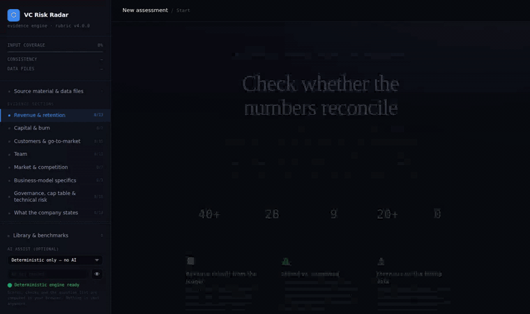
</p>

---

## The problem

A founder sends a deck, a model and an update. The headline numbers — NRR, growth, CAC payback, runway, Rule of 40 — are usually *stated*, not *derived*, and they often don’t reconcile with the company’s own raw data. A deck that says **134% NRR** while the customer ledger gives **99%** is the most common diligence catch, and the easiest to miss on a first read. Rebuilding the numbers by hand takes an associate days of spreadsheet work per deal.

VCR2 does that work in about a second, shows its working, and never hides a judgement inside a black box.

## What it does

| | |
|---|---|
| **🛠️ An owner Studio** | The owner of the site can change everything that decides how a company is judged — healthy ranges, answer scores, weights, defaults, red-flag triggers, check tolerances — add fields, metrics, checks, deal-breakers, questions, red flags, benchmarks, checklist items and business models, and rename or switch off anything built in. Then publish to the live site in one click. No code. [How it works →](STUDIO.md) |
| **🧾 Rebuilds revenue from the ledger** | Upload revenue by customer by month — any billing-system export, wide or long, as CSV or straight from Excel (.xlsx, read in the browser with no library). VCR2 builds the monthly MRR bridge — new, expansion, reactivation, contraction, churn — which closes to the dollar, plus **true cohort NRR and GRR**, logo retention, concentration (top 1/5/10, HHI) and cohort heatmaps. It also shows how far a waterfall-style NRR is inflated by expansion from customers acquired during the year. |
| **⚠️ Stated vs. computed** | 29 consistency checks compare what the company states with what the primitives and the ledger produce. A **binomial test** flags when the discrepancies all happen to flatter the company — honest errors point both ways. |
| **🔬 Forensics on billing data** | Nine tests, each with its method and its limits: final-month booking spikes before a raise, quarter-end pull-forward, one-month “recurring” customers, near-duplicate logos, one-off charges booked as MRR, reactivations hidden in new business, negative entries, growth smoothness, and a Benford first-digit test with an applicability check. |
| **🎲 Runway odds, not a runway number** | Paul Graham’s *default alive* test, plus a **seeded Monte Carlo** (4,000 paths) with decaying growth and the company’s own volatility: probability of reaching the next-stage ARR bar before cash-out, runway distribution, and the capital needed to get there at 50% and 80% confidence. |
| **💼 Deal maths to the exit** | Pool shuffle, SAFE and **convertible-note** conversion (with accrued interest) at cap or discount, effective pre-money, ownership at entry and after future dilution, the exit that returns your fund, and a full **liquidation waterfall** — participating, non-participating or **capped** — with convert-or-take-preference logic. |
| **📈 VC Method and First Chicago** | Downside, base and upside exit cases with probabilities give the multiple and IRR this price produces, the post-money a target return justifies (Sahlman’s VC Method, on the success case) and the probability-weighted value (First Chicago). Every assumption is shown and editable. |
| **📝 Term-sheet review** | Liquidation preference, participation and its cap, anti-dilution (full ratchet vs. weighted average), dividends, redemption, pay-to-play, board control, pro-rata and information rights — each compared with the market-standard version (NVCA model documents, YC Series A template). |
| **🧩 40+ compound risk patterns** | Growth bought with paid acquisition, leaky bucket, services wearing a software multiple, concentration on short contracts, window dressing before a raise, AI inference-margin trap, off-market terms, a price that cannot clear the target return, weak product-market fit, a discretionary product, a new or non-technical founding team, finance and tax hygiene — and the strengths too. |
| **🗺️ Risk map** | Every red and amber signal grouped the way an investment committee discusses risk: product, market & timing, execution & team, financial & reporting, legal & regulatory, deal & structure. |
| **✅ Diligence checklist by stage** | Around 60 items across ten data-room categories — founders, financial, tax, cap table & legal, customers, product, IP, HR, security, insurance — scoped to the stage, pre-filled from your inputs and uploads, tracked item by item, and carried into the memo. |
| **📐 Evidence-weighted, stage-calibrated scoring** | Every field records where its number came from (founder said → deck → model → system export → bank record → audited). Weak evidence widens the confidence band. Four stage rubrics, four business models, product-market-fit signals (the Sean Ellis 40% test, NPS), hard gates on IP, cap-table and unpaid-tax issues, and metrics withheld below the sample size where they carry signal. |
| **📚 Learns from your deals** | Save each run to a local **Library**, import comparables from CSV, or paste anything — a newsletter, a portfolio update, meeting notes — and let a model you choose structure it for review. VCR2 then ranks each new company against your own data and can **recalibrate its thresholds on your library**. |
| **📋 Output you can use** | A ranked question list, a ready-to-send founder email, a data-room request list, a print-ready **IC memo (PDF)**, Markdown and a JSON export anyone can re-open. |

## Screenshots

| Overview and risk patterns | Revenue rebuilt from the ledger |
|---|---|
| 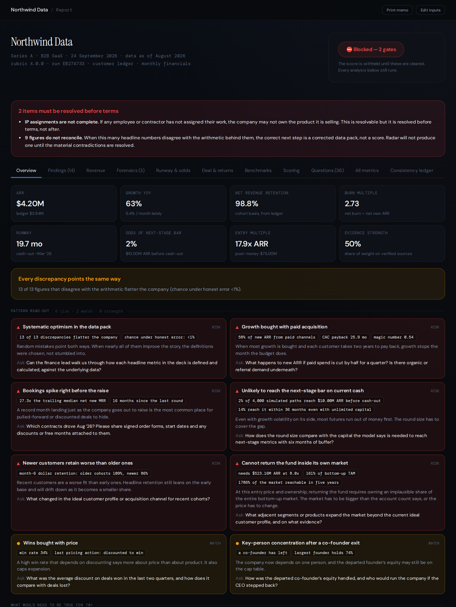 | 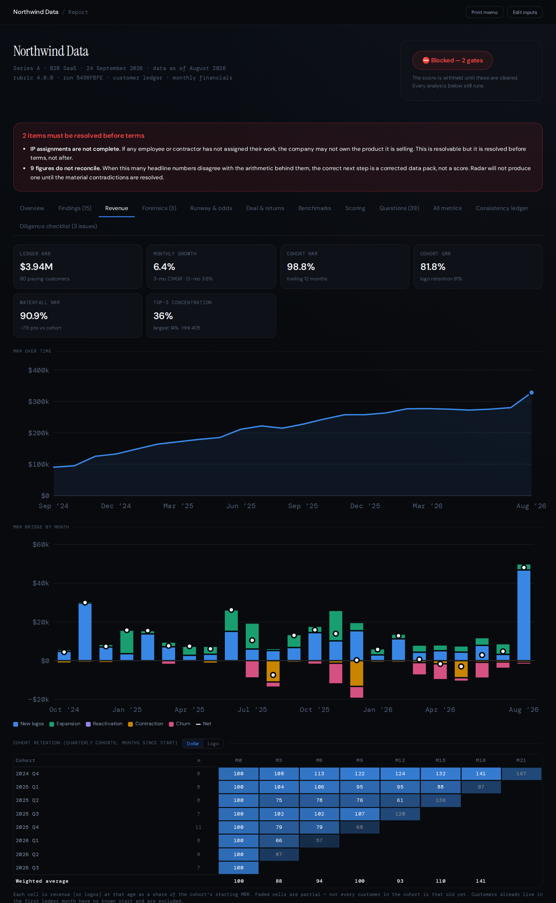 |
| **Runway odds (Monte Carlo)** | **Deal maths and liquidation waterfall** |
| 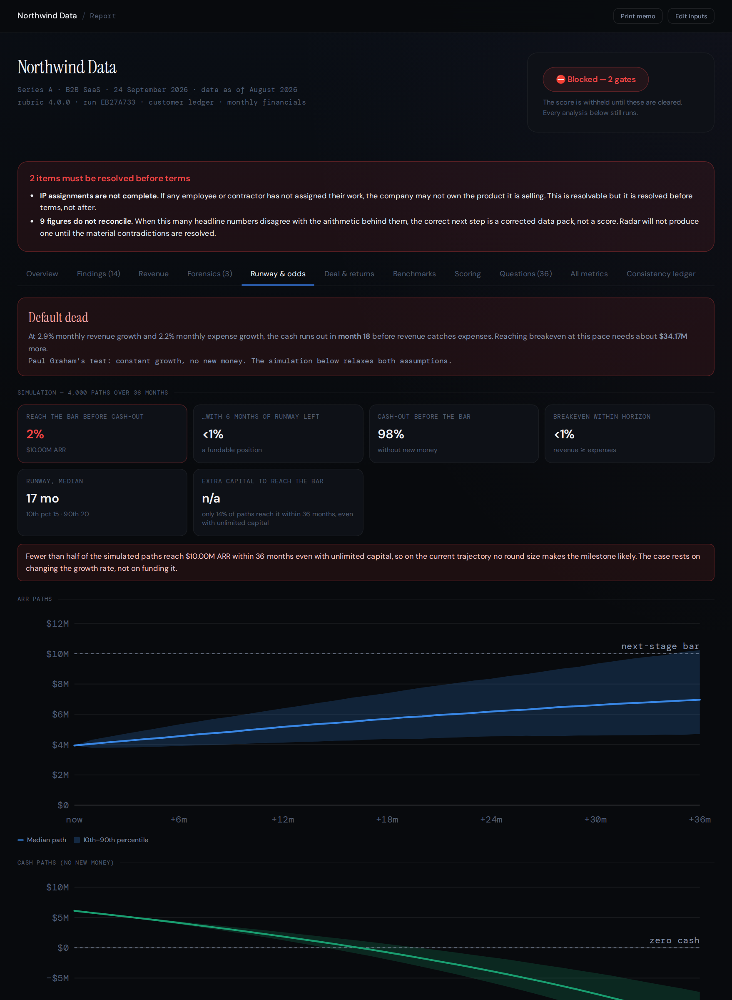 | 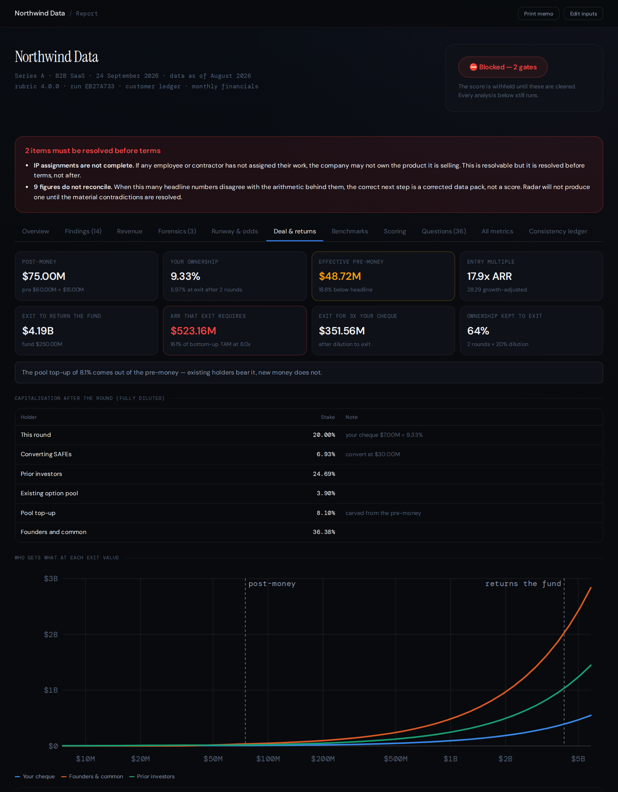 |
| **Verification before any score** | **A clean data pack earns a score** |
| 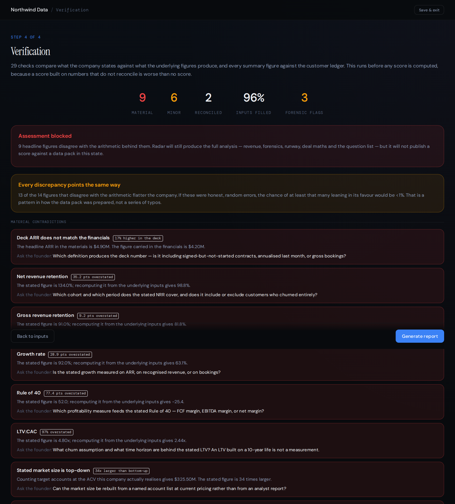 | 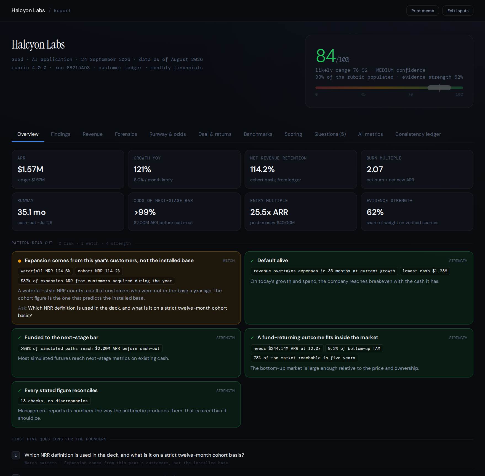 |
| **Risk map by type** | **VC Method and First Chicago returns** |
| 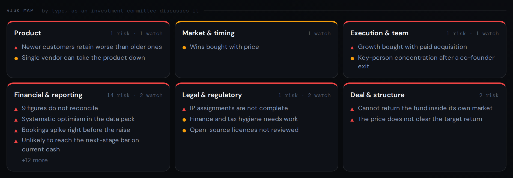 | 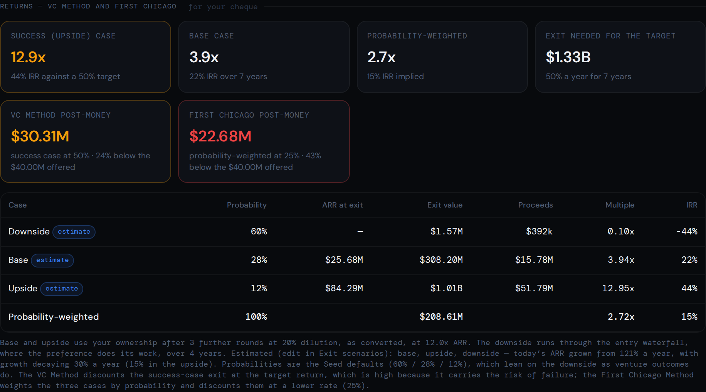 |

<p align="center"><b>Owner Studio — start from what an investor told you</b><br>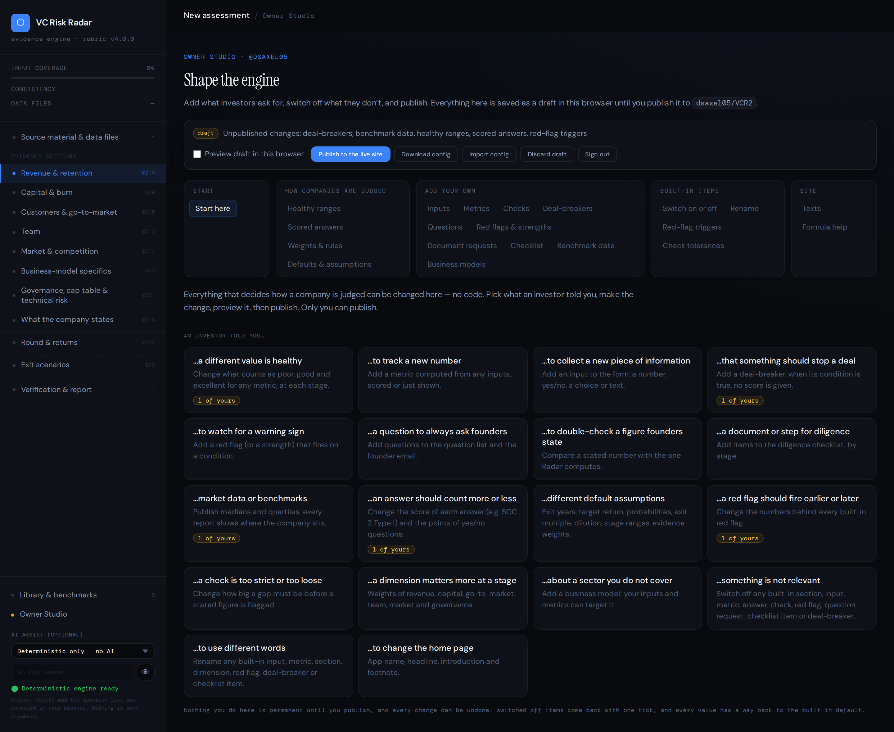</p>

<p align="center"><b>Owner Studio — add metrics, questions and checks without code</b><br>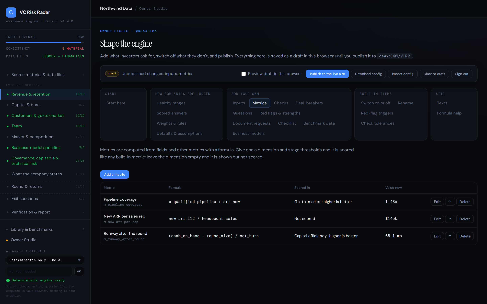</p>

## How to use it

1. **Setup.** Company, stage and business model. Stage sets the thresholds and weights; the model selects which metrics are scored.
2. **Source material.** Drop in the customer revenue ledger and monthly financials as CSV or Excel (parsed locally, no AI). Optionally paste the deck, memo or term sheet and extract figures with a model you choose — every extracted value keeps the line it came from.
3. **Evidence.** Review every field and tag where each number came from. Figures the ledger can supply are filled for you; anything entered by hand is checked against it.
4. **Verification, then the report.** Contradictions are shown before any score. The report has twelve views: overview (with the risk map), findings, revenue, forensics, runway & odds, deal & returns (with the VC Method, First Chicago and the term-sheet review), benchmarks, scoring (with a sensitivity tornado and “what would need to be true”), questions, all metrics, the consistency ledger and the diligence checklist.

Sample files to try the uploads are in the repository — a customer ledger (CSV and Excel), monthly financials and a comparables template.

## Owner Studio

Investors ask for different things. The Studio lets the owner add them without touching code: open **`/#studio`**, sign in with a GitHub token, and change the engine.

- **Start from what an investor told you** — the Studio's start page sends you to the right screen.
- **Retune** what counts as healthy for any metric at any stage (reports mark it “your standard”), the score of every answer and yes/no question, dimension and metric weights, every default assumption (exit years, target return, probabilities, exit multiple, dilution, stage ranges, evidence weights), the numbers behind every built-in red flag and term-sheet norm, and the tolerance of every consistency check.
- **Add** evidence fields, metrics computed with a formula (`new_arr_l12 / headcount_sales`), stated-vs-computed checks, deal-breakers (`top1_pct > 50`), conditional questions (`nrr < 100 and customers_now >= 20`), red flags and strengths, document requests, checklist items, published benchmarks and new business models.
- **Switch off or rename** any built-in section, field, metric, check, forensic test, red flag, question family, request, checklist item, dimension or deal-breaker.
- **Preview** the draft in your own browser, then **publish**: the Studio commits `radar-config.json` to the repository and every visitor gets it within a minute.

Only the repository owner can publish. The Studio verifies with GitHub that the token belongs to the owner and can write to the repository, and the live site only ever reads the committed file. Formulas run in a small built-in interpreter — nothing is executed as code — and missing data is never silently treated as zero. Anything that changes scores changes the rubric version printed on every report. Full guide: **[STUDIO.md](STUDIO.md)**.

## Methodology

Everything is deterministic and versioned. The same inputs and rubric version always produce the same score, and every run carries a hash that includes the ledger, the evidence tags and any calibration. The full specification — every formula, tolerance, forensic threshold, the scoring and confidence-band maths, the simulation, the deal conventions and the waterfall algorithm — is in **[METHODOLOGY.md](METHODOLOGY.md)**.

A few of the formulas:

| Metric | Formula |
|---|---|
| Cohort NRR (from the ledger) | today’s MRR of customers live 12 months ago ÷ their MRR then |
| Cohort GRR | same base, each customer capped at its starting MRR |
| Burn multiple | annualised net burn ÷ net new ARR |
| Magic number | net new ARR in the quarter ÷ prior-quarter S&M |
| CAC payback | CAC ÷ monthly gross profit per customer |
| Effective pre-money | headline pre − (pool top-up + SAFE conversion) × post-money |
| Exit to return the fund | fund size ÷ ownership at exit |
| VC Method post-money | success-case exit × ownership kept ÷ (1 + target return)^years |
| Runway if revenue stopped | cash ÷ gross monthly burn |
| Optimism test | P(X ≥ k), X ~ Binomial(n, ½), over discrepancies that flatter the company |

## Design principles

- **Never ask for a number that can be derived.** Runway, NRR, burn multiple and payback are computed, never typed in.
- **Prefer the company’s data to its summary.** A customer ledger outranks a deck; a bank statement outranks a model.
- **Refuse to score bad data.** Three or more material contradictions, or an open IP or cap-table gate, withholds the score — the analysis still runs.
- **Weight evidence, not just values.** Unverified inputs widen the confidence band.
- **Show the working.** Every metric carries its formula, every test its method and limits.
- **The model never scores.** AI is optional and only extracts figures or drafts prose around numbers the engine has already computed.

## Privacy and security

- The ledger, the derivations, the checks, the simulation and the score all run **entirely in your browser**. Nothing is uploaded anywhere.
- The site loads its published configuration (`radar-config.json`) from the same repository. The Owner Studio talks only to `api.github.com`, with the owner’s own token.
- The only other network calls are the optional AI features (extraction, AI import, memo narrative), which send text to the provider **you** choose — Anthropic, OpenAI, Gemini, Groq or OpenRouter — using **your own** key. The model name can be overridden in the sidebar.
- The key and your library are stored in your browser’s `localStorage`. There is no VCR2 server. Use a restricted, low-spend key and don’t paste confidential data-room material into a provider you haven’t cleared.

See [SECURITY.md](SECURITY.md).

## Honest limits

- Default thresholds are **editable calibrations, not market statistics**. Recalibrating on your own library makes them yours.
- Forensic tests are **reasons to look, never proof**. Price lists, annual true-ups and seasonal businesses produce some of the same shapes, and each test says so.
- The simulation is only as good as its inputs: growth, volatility and spend growth come from the company’s own history when available, and every assumption is shown and editable.
- The deal model uses standard conventions (post-money SAFEs, pari passu preferred) and says when it is estimating a missing input.

## Project structure

```
index.html              the whole app — one self-contained file, zero dependencies
radar-config.json       the owner's published configuration (written by the Studio)
build.py                rebuilds index.html from the source files below

core.js                 evidence schema, derivations, checks, rubric, scoring, pipeline
ledger.js               ledger parsing, MRR bridge, cohorts, concentration, forensics
series.js               monthly financials, trajectory, default-alive
sim.js                  seeded Monte Carlo
deal.js                 ownership, dilution, notes, term review, VC Method, First Chicago, waterfall
checklist.js            stage-based diligence checklist
patterns.js             compound risk patterns, optimism test, sensitivity
library.js              local library, CSV and AI import, percentiles, calibration
charts.js / report.js   the report and its SVG charts
exports.js              IC memo, founder email, JSON, Markdown
config.js               configuration layer and the safe formula language
studio.js               the owner Studio and GitHub publishing
xlsx.js                 dependency-free Excel reader

engine.test.mjs         engine and configuration tests, run headlessly with Node (CI on every push)
METHODOLOGY.md          every formula, tolerance and convention
STUDIO.md               the owner Studio guide
northwind-*.csv / .xlsx sample customer ledger and monthly financials
```

**Run it locally:** open `index.html` in a browser, or `python3 -m http.server 8000`.
**Run the tests:** `node engine.test.mjs`
**Rebuild after editing `src/`:** `python3 build.py`

The engines are also exposed as `window.Radar` — `Radar.assess({...})` runs a full assessment headlessly and returns every metric, check, pattern, projection and question.

## Roadmap

- [ ] Customer reference-call notes → structured signals (AI-assisted, with quotes)
- [ ] Side-by-side comparison of two companies
- [ ] Shared team library (optional sync)
- [ ] Revenue-quality checks against invoices and bank receipts
- [ ] More business-model modules (hardware, consumer subscription)

## Disclaimer

VCR2 is a workflow tool. It does not provide investment advice, and its score is not a recommendation to buy or sell any security. The example companies are fictional and their data is synthetic.

## Author

Built by **Axel De Sousa** — Finance and AI Analysis at Menlo College.
[GitHub](https://github.com/dsaxel05) · [LinkedIn](https://www.linkedin.com/in/axeldesousa/)
## License

[MIT](LICENSE) © 2026 Axel De Sousa
